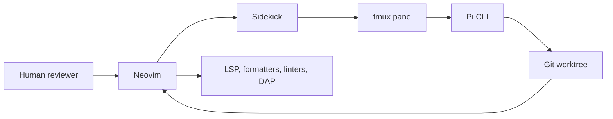

# Home

[Repository](https://github.com/jczhang02/nvim) | [README](https://github.com/jczhang02/nvim/blob/main/README.md) | [Troubleshooting](./Troubleshooting.md)

This Wiki documents a personal Neovim 0.12.4+ configuration built around a
specific division of work: Neovim is the editing and review surface, while Pi
runs in tmux and works inside the current Git worktree.

The pages describe the current configuration. Lua files remain authoritative
for behavior, `lazy-lock.json` remains authoritative for plugin revisions, and
runtime discovery remains authoritative for active mappings.

## Configuration at a glance

| Component | Owns |
|---|---|
| Neovim | Buffers, edits, diagnostics, diff review, formatting requests, and DAP control |
| Lazy | Plugin installation and locked checkouts |
| Treesitter | Parsers under Neovim's data directory |
| Mason | codelldb only |
| mise or system `PATH` | Language servers, formatters, linters, Delve, and debugpy |
| Sidekick and tmux | Persistent CLI panes and context handoff |
| Git worktrees | Isolation between concurrent tasks |

## Choose a path

| If you want to... | Start here |
|---|---|
| install the configuration on a new machine | [Getting started](./Getting-Started.md) |
| understand startup, state, and configuration boundaries | [Architecture and customization](./Architecture-and-Customization.md) |
| find the normal editing, Git, DAP, session, or Pi workflow | [Features and workflows](./Features-and-Workflows.md) |
| install or inspect a language tool | [Language tooling](./Language-Tooling.md) |
| find a key or resolve a mapping conflict | [Keymap reference](./Keymap-Reference.md) |
| diagnose a failure or warning | [Troubleshooting](./Troubleshooting.md) |
| update plugins, run CI checks, or publish the Wiki | [Development and maintenance](./Development-and-Maintenance.md) |

## Design boundaries

The configuration makes several deliberate choices:

- Sidekick is a CLI bridge. It does not provide an embedded chat interface.
- Pi runs in tmux. Agent processes do not run inside Neovim buffers.
- Copilot LSP and Sidekick Next Edit Suggestions are disabled.
- Neo-tree remains the persistent filesystem, buffer, and Git status explorer.
  Snacks handles transient pickers, scrolling, terminals, notifications, and
  profiling.
- Native `vim.lsp.config` and `vim.lsp.enable` own LSP startup.
- Blink owns completion, but its experimental signature UI is disabled.
  `ray-x/lsp_signature.nvim` handles signature help.
- Project formatter configuration wins. Personal settings do not replace a
  repository's Stylua, clang-format, or Prettier rules.
- Mason does not modify `PATH` and does not install LSP servers or formatters.
- Sessions are branch-aware but never load automatically.
- The plugin update checker is disabled. `lazy-lock.json` changes only during an
  intentional update.

## Source and publishing model

The `wiki/` directory in the main repository is the only editable source for
this documentation. `_Sidebar.md` defines the page order and `_Footer.md`
provides repository links when the files are published to GitHub Wiki.

GitHub stores a Wiki in a separate `<repository>.wiki.git` repository. This
repository does not have that remote yet. The publication procedure in
[Development and maintenance](./Development-and-Maintenance.md#publishing-to-github-wiki)
renders source H1 headings and `.md` links into GitHub Wiki form, then performs a
one-way synchronization. Editing the published Wiki directly would create a
second source of truth.

## Reporting a documentation problem

A useful report includes the page, the configuration file that disagrees with
it, the current Neovim version, and the output of the smallest relevant check.
Use [Troubleshooting](./Troubleshooting.md#information-to-collect) to collect the
runtime state first.
